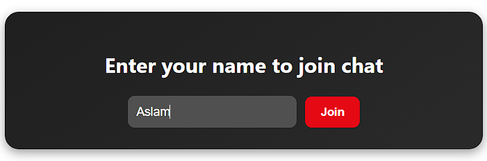
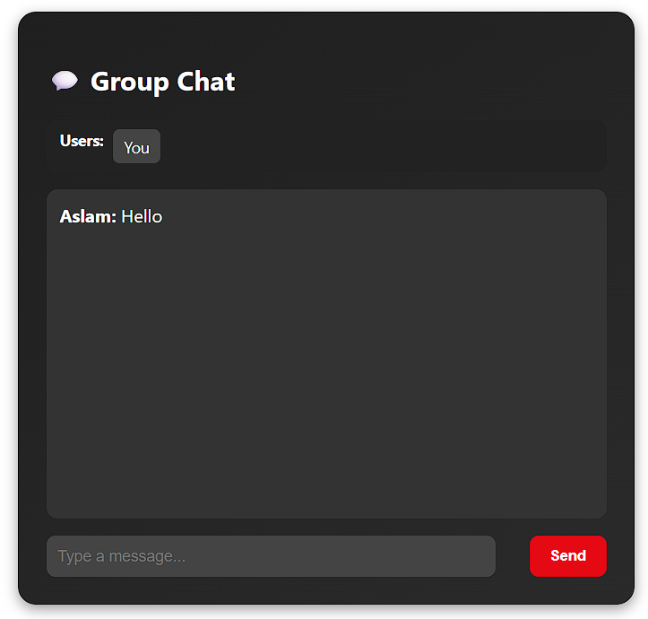
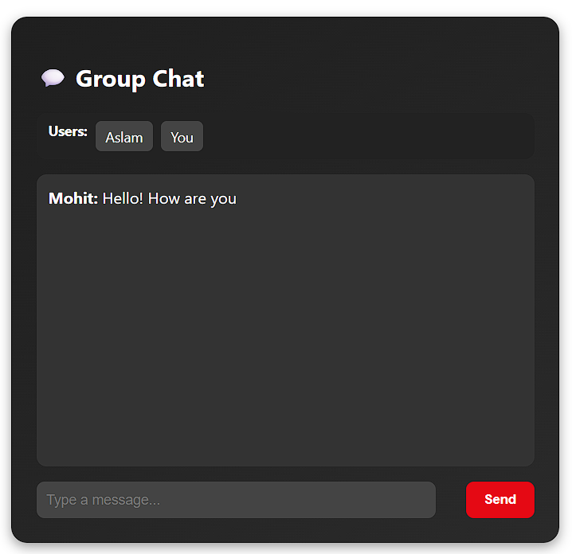
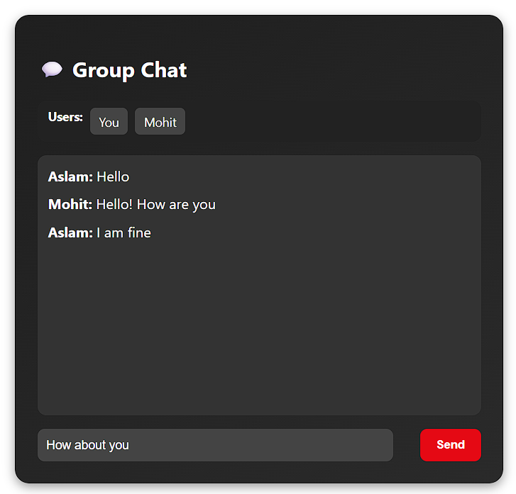

# 💬 REAL-TIME CHAT APPLICATION

**COMPANY:** CODTECH IT SOLUTIONS  

**NAME:** Mo Aslam Khan  

**INTERN ID:** CT08DN1583  

**DOMAIN:** React.js Web Development  

**DURATION:** 8 WEEKS  

**MENTOR:** NEELA SANTOSH

---

## 📄 TASK DESCRIPTION

The Real-Time Chat Application is Task 3 of my internship under CODTECH IT Solutions. The goal of this project was to build a real-time communication platform using React.js and Socket.IO that supports both group chat and private one-to-one messaging.

This application allows users to register with a username and immediately join a group chat. They can also select another user and initiate a private conversation. The app features real-time message delivery, typing indicators, and live user lists using WebSocket technology.

The project taught me how to implement bi-directional communication between client and server, manage unique socket connections, and design a clean and responsive user interface. It includes backend logic for managing user sessions and routing messages properly, and a frontend for displaying chat messages dynamically.

---

## 🔧 Technologies Used

- **React.js** – For building the frontend interface 
- **Node.js & Express** – For creating the backend server
- **Socket.IO** – For real-time, bi-directional communication
- **JavaScript (ES6+)** – For logic and interactivity  
- **HTML5 & CSS3** – For structure and styling 
- **Git & GitHub** – For version control and collaboration  

---

## ✅ Functionality & Features

* 💬 **Group Chat** – All users can participate in a shared chat room *
* 👤 **One-to-One Private Chat** – Send private messages to selected users *
* ✍️ **Typing Indicator** – Shows when a user is typing *
* 🔄 **Real-Time Updates** – Messages and user status update instantly *
* 📱 **Responsive Design** – Works on both mobile and desktop *
* 🧩 **Minimal and Clean UI** – Easy-to-use layout with user selection *
* 🧠 **Socket Management** – Each user session is tracked and broadcast properly”

---

## 🛠️ Project Structure 
* **Frontend (`React.js`)** *
  * `App.js`: Core logic and UI *
  *  `App.css`: Styling and responsive layout
  * Components for chat box, message input, and user list *
* **Backend (`Node.js` + `Socket.IO`)** *
  * `index.js`: Handles socket connections, emits events, and manages user mapping”
 
---

## 🚀 How It Works 
1. User enters their name and joins the chat
2. User list is updated in real-time
3. Messages can be sent to everyone or privately to a selected user
4. Typing status is displayed if someone is writing a message
5. All messages are displayed live with sender info”

---

## 📸 Output Screenshots

